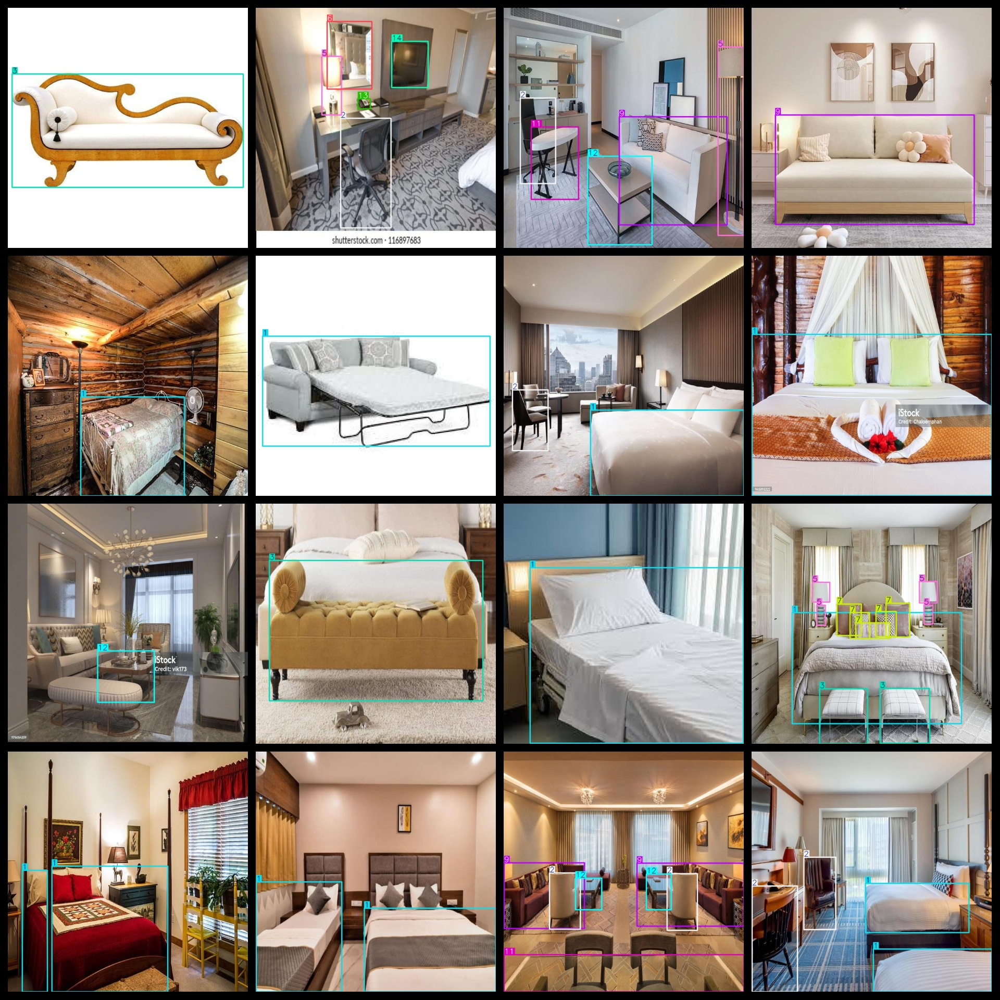
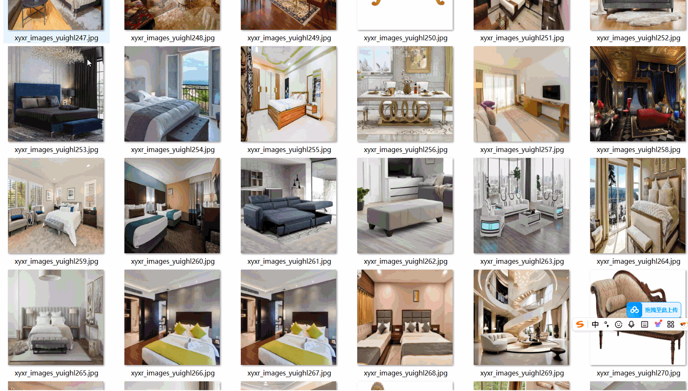

# 15 Types of Furniture Detection Dataset

A 15-type furniture detection dataset with 2943 images in VOC+YOLO format.

The dataset is formatted as follows:

- Three folders inside the zip file, each containing images, xml files, and txt files.
- The JPEGImages folder contains a total of 2943 JPG images.
- The Annotations folder contains a total of 2943 xml files.
- The labels folder contains a total of 2943 txt files.
- There are 15 types of labels: ["0", "1", "2", "3", "4", "5", "6", "7", "8", "9", "10", "11", "12", "13", "14"].
- The number of boxes (notice that the yolo format category order doesn't match this; it is based on the classes.txt in the labels folder):

0 boxes = 33

1 boxes = 1951

2 boxes = 1840

3 boxes = 727

4 boxes = 263

5 boxes = 769

6 boxes = 93

7 boxes = 1670

8 boxes = 56

9 boxes = 1634

10 boxes = 352

11 boxes = 835

12 boxes = 980

13 boxes = 142

14 boxes = 181

Total boxes: 11526

The image resolution is clear.

The images are not enhanced.

The shape of the labels is rectangular boxes, used for target detection recognition.

Important note: No guarantees are made regarding the accuracy or weights of the trained models using this dataset. The dataset provides accurate and reasonable annotations only. The labels correspond to the following 15 types of furniture:

Small ottomans

Bed

Chair

Couch

Flower vase

Lamp

Mirror

Pillow

Remote

Sofa

Switchboard

Table

Teapots

Telephone

TV

## Images

---

Here is a pay link on Stripe (https://buy.stripe.com/3cs8yP7sY87d0vu9AB). Please contact me lonlonago@foxmail.com after funding $89, and I will send you a complete data files, thank you!

